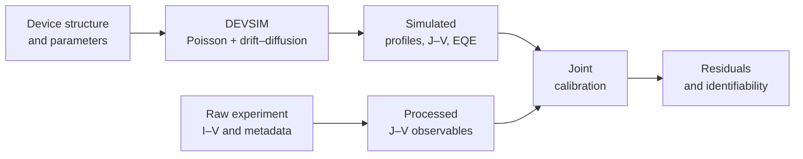
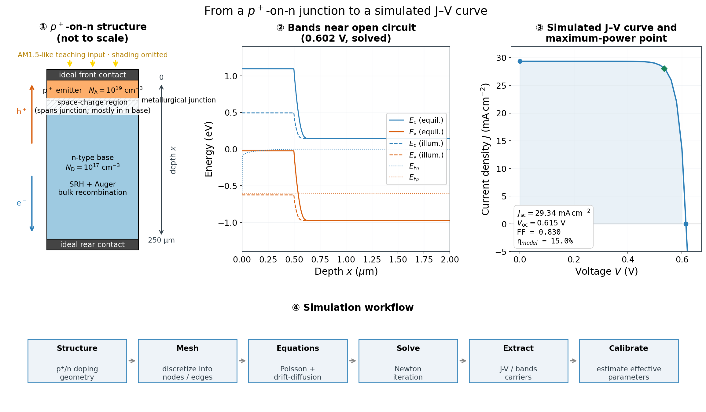
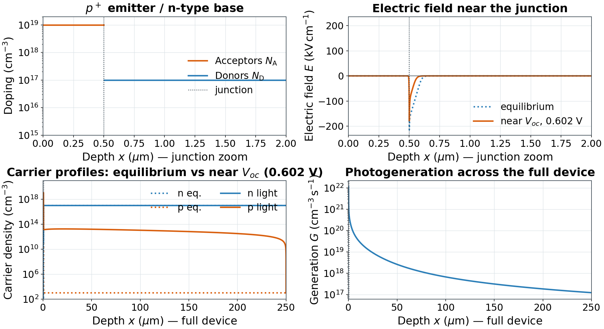
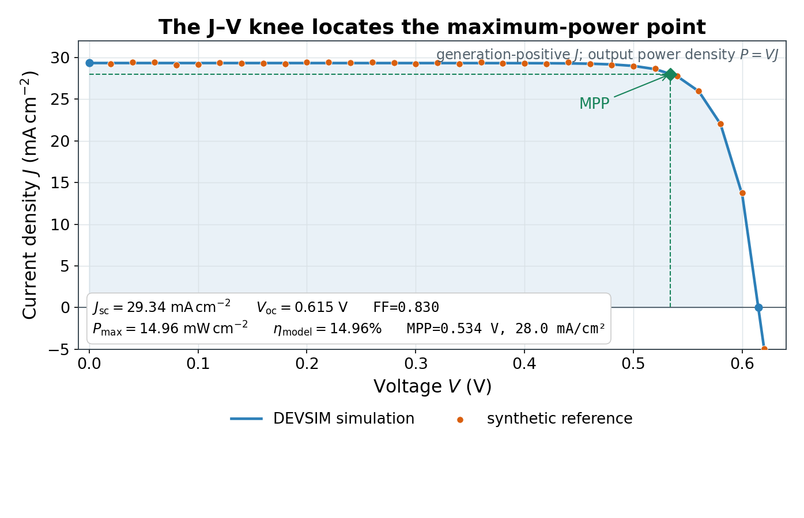
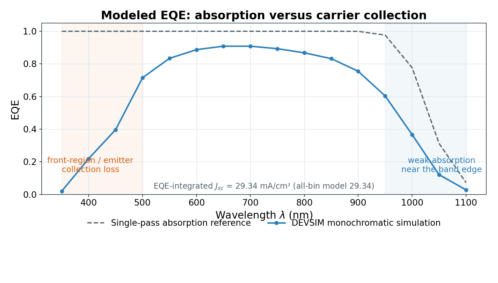
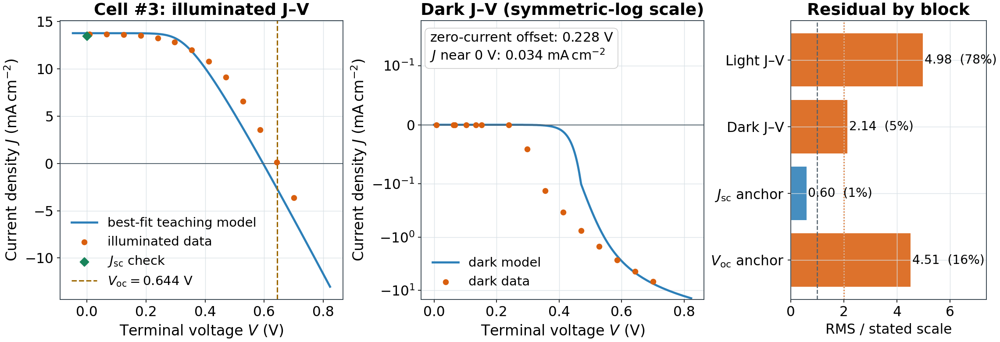
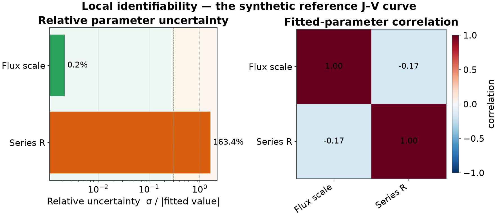

<p align="center">
  
</p>

<h1 align="center">DEVSIM Silicon Solar Cell</h1>

<p align="center">
  <strong>An undergraduate teaching project for semiconductor simulation, experiment, and parameter calibration</strong><br>
  A one-dimensional, front-illuminated p<sup>+</sup>-on-n silicon solar cell
</p>

<p align="center">
  <a href="https://github.com/chenzhang0920/devsim-silicon-solar-cell-teaching/actions/workflows/tests.yml"></a>
  <a href="LICENSE"></a>
  <a href="LICENSE-CONTENT.md"></a>
</p>

This repository is the teaching and laboratory project for **MICS3090 (L01) —
Integrated Circuit Devices**. It connects the equations taught in class to a working
[DEVSIM](https://devsim.net/) model, measured solar-cell data, and a deliberately small
inverse problem. The aim is not merely to produce a curve: students must explain the
device physics, check the experiment, evaluate residuals, and decide which fitted
parameters the available observations can support.



> **Scope:** this is a transparent teaching model for second-year students. It is not
> an industrial process deck or a claim of fabrication-grade parameter extraction.

## 🎓 Course information

| Item | Information |
|---|---|
| Course | **MICS3090 (L01) — Integrated Circuit Devices** |
| Instructor | **Renjie WANG** |
| Teaching assistant | **Zhang CHEN** · [zchen758@connect.hkust-gz.edu.cn](mailto:zchen758@connect.hkust-gz.edu.cn) |
| TA office | **W2-4F-028** |
| Project weight | **10% of the course grade** |
| Assessment | **Five tasks, 100 points** · [public rubric](docs/grading.md) |

Student entry points:

- [Tutorial Notebook](notebooks/tutorial.ipynb) — the guided, executable lesson;
- [Student Lab Guide](docs/lab_guide.md) — what to run, submit, and explain;
- [Experiment Protocol](docs/experiment_protocol.md) — measurement and metadata rules;
- [Classroom Slides](docs/lab_slides.html) — the projection-ready lesson deck.

GitHub displays the slide file as source. After cloning or downloading the repository,
open `docs/lab_slides.html` in a browser and use the arrow keys or Space to present it;
printing from the browser produces a 16:9 PDF handout.

## 🎯 Learning outcomes

After completing the project, students should be able to:

- translate a p<sup>+</sup>-on-n device description into a one-dimensional mesh,
  doping profile, contacts, and boundary conditions;
- relate Poisson and carrier-continuity equations to bands, electric field, carrier
  distributions, recombination, and terminal current;
- use continuation from equilibrium to dark, illuminated, and biased states;
- interpret a solar-cell J–V curve, its standard performance metrics, and modeled EQE;
- convert raw instrument current into traceable current-density data with correct area,
  units, polarity, and metadata;
- calibrate a small set of effective parameters against several compatible observables;
- use residuals, uncertainty, correlation, and parameter bounds to discuss
  identifiability and model limitations.

## 🚀 Quick start

Conda is recommended because DEVSIM includes native libraries:

```bash
git clone https://github.com/chenzhang0920/devsim-silicon-solar-cell-teaching.git
cd devsim-silicon-solar-cell-teaching

conda env create -f environment.yml
conda activate devsim_solar

python -c "import devsim; print('DEVSIM:', devsim.__version__)"
python -m pytest tests -q
python scripts/run_sim.py
python scripts/plot_iv.py --csv results/iv_sim.csv
jupyter lab notebooks/tutorial.ipynb
```

The Notebook already contains checked teaching outputs, so it can be read on GitHub
before the environment is installed. Run commands from the repository root unless a
script's `--help` text says otherwise.

For a reproducible project-wide rebuild, use the aggregate Bash runner (Linux, macOS,
WSL, or Git Bash):

```bash
bash scripts/run_all.sh full
bash scripts/run_all.sh check
```

The `full` profile regenerates the deterministic synthetic J-V reference from the current
`config.py`, then rebuilds the standard figures, synthetic smoke-test calibration,
Cell #3 joint calibration, and the executed Notebook. Use
`bash scripts/run_all.sh help` to see focused simulation, calibration, EQE, data
conversion, and Notebook workflows. On Windows PowerShell, the underlying Python scripts
can be run directly in the activated environment.

Raw experimental conversion is deliberately **not** part of `full`: illuminated area,
wiring polarity, and sample identity must be confirmed for each measurement session.
After replacing raw files, run `prepare_keithley.py` or `prepare_data.py` with the recorded
experimental settings before calibrating; otherwise existing processed tables will still
be used. The `full` profile always rebuilds the checked Cell #3 course example. For a new
sample, run `bash scripts/run_all.sh joint --sample <ID>` (or the corresponding Python
calibration command) after conversion.

## 🔬 Model and conventions

Light enters at `x = 0`, through the front contact and p<sup>+</sup> emitter. The
n-type base extends to the rear contact:

```text
light  →  front contact | p⁺ emitter | p–n junction | n-type base | rear contact
                         x = 0  ───────────────────────────────→  depth
```

The terminal convention is
`V = V_front(p) − V_back(n)`. Illuminated current density is positive when the cell
delivers current, so the light J–V curve begins with positive short-circuit current and
crosses zero at open circuit. Dark forward current is negative under the same convention.

The forward model includes:

- finite-volume Poisson and electron/hole drift–diffusion equations;
- SRH and Auger bulk recombination;
- effective front and rear surface-recombination losses;
- a finite-bin teaching spectrum with Beer–Lambert absorption;
- ohmic contacts and optional effective terminal series/shunt resistance.

Core device, solver, and calibration defaults—and their units—are centralized in
[`config.py`](config.py). Students should change that file or documented command-line
options instead of copying physical constants into scripts or the Notebook.

### What the model does not claim

| Included for learning | Important simplifications |
|---|---|
| 1D abrupt p<sup>+</sup>-on-n structure | no texture, front-contact shading, fingers, lateral current spreading, or 2D/3D geometry |
| constant low-field mobilities at 300 K | Boltzmann statistics; no degeneracy, band-gap narrowing, field/doping-dependent mobility, self-heating, or temperature sweep |
| effective bulk and surface recombination | no process-calibrated interface-state or passivation model |
| finite-bin absorption model | no precision ASTM spectrum, interference, ray tracing, or calibrated antireflection stack |
| effective terminal parasitics | no spatial contact or interconnect solution |

These simplifications make causal relationships visible and runs short enough for a lab.
They also set the limit of any fitted parameter's physical interpretation. Record the
experimental temperature; a meaningful departure from 300 K must be reported as a
model–experiment limitation rather than hidden by changing `config.py`.

The 16 optical bins approximate the above-band-gap photons that drive generation. The
illustrative efficiency uses a separately stated total modeled irradiance of 100 mW/cm²,
which also represents incident spectral power omitted from the generation bins. This
separation is intentional and is not a precision ASTM G173 power balance.

## 🧪 Data: measured, processed, and synthetic

The directory name is part of the provenance record:

| Location | What belongs there | How to use it |
|---|---|---|
| [`data/raw/`](data/raw/README.md) | unmodified instrument exports | preserve as the experimental source record |
| [`data/processed/`](data/processed/README.md) | standardized experimental J–V tables and summaries | use for measured-data analysis and calibration |
| [`data/synthetic/`](data/synthetic/README.md) | deterministic model-generated J–V example | use only for hardware-free smoke tests |
| `results/` | rebuildable simulations, figures, fit metadata, and reports | never present these as new measurements |

The bundled Cell #3 and Cell #4 files are **historical course measurements** provided so
the complete workflow can be demonstrated before a new lab session. They are not a
student's own experimental result. The synthetic J–V file is generated by the model and
must not be described as measured data.

When replacing the examples with a new experiment:

1. keep the original export unchanged under `data/raw/`;
2. record sample, illuminated area, temperature, source condition, wiring, instrument
   settings, sweep direction, units, and polarity;
3. convert a generic illuminated I–V sweep with `prepare_data.py`, or a complete native
   Keithley measurement bundle with `prepare_keithley.py`, using the measured area rather
   than an example value;
4. inspect the processed curve for units, ordering, short-circuit coverage, and a
   physically consistent zero crossing;
5. keep the exact inputs, configuration, fitted metadata, residuals, and figures together.

Experimental efficiency may be reported only when irradiance at the cell plane has been
measured independently. An effective generation scale or a total optical-power reading is
not a substitute for irradiance.

## 🎯 Canonical calibration: Cell #3

The recommended teaching inverse problem is the Cell #3 joint calibration:

```bash
python scripts/run_calibration.py --joint --sample 3
```

It combines four compatible evidence blocks while keeping their scales and weights
explicit:

| Observable | Information contributed |
|---|---|
| illuminated J–V | photocurrent, knee shape, and zero crossing |
| dark J–V | cross-check of diode/leakage behavior; limited leverage on effective series resistance |
| repeated illuminated short-circuit readings | independent current anchor and repeatability |
| illuminated open-circuit voltage | independent voltage anchor |

The canonical joint exercise varies only a deliberately small set of effective parameters. In
particular, the fitted generation scale is not a measured number of suns, and an effective
series resistance may include the device, contacts, wiring, and model discrepancy. A close
curve is therefore not sufficient evidence of a unique material parameter.
The dark curve is chiefly a cross-observable model check in this two-parameter exercise; it
does not identify lifetime, SRV, or detailed diode physics because those quantities remain
fixed by design.

For classroom-speed optimization, the objective evaluates the terminal circuit equation at
the measured points. The plotted metrics are then recomputed from a self-consistent terminal
J–V curve. An exact fit makes these views agree; when systematic mismatch remains, prioritize
the plotted RMSE and residual pattern, and interpret covariance only as local optimizer
sensitivity—not as proof that the model or parameters are physically adequate. The saved
normalized block score is a weighted mean squared discrepancy: 1 matches the stated scales
on average and 4 corresponds to a twice-scale weighted RMS mismatch. It is deliberately not
presented as a statistical reduced chi-square.

Interpret these outputs together:

- `results/joint_observables.png` — agreement across all observation blocks;
- `results/joint_metrics.json` — numerical residual summaries;
- `results/joint_fitted_params.json` and `results/joint_fit_metadata.json` — fitted values,
  bounds, uncertainty, configuration, software versions, and data provenance;
- `results/joint_identifiability.png` — local covariance sensitivity and parameter
  correlation, explicitly qualified by the fit-quality gate.

To redraw the saved joint fit without running the optimizer again, use:

```bash
python scripts/plot_fit.py --params results/joint_fitted_params.json
```

The replay command verifies the recorded data hashes and solver configuration before it
recreates the figure and numerical checks.

Measured EQE is not required for the assessed workflow. The supplied EQE figure is a
modeled spectral-collection exercise; measured EQE can be added later as an independent
extension when suitable laboratory data exist.

## 📊 Teaching figures

The checked figures follow the conceptual order used in the Notebook and lab guide.
Captions state whether an item is simulated, synthetic, or measured.

<p align="center">
  
  <br><sub><strong>Model map.</strong> Structure, equations, solution sequence, and observables.</sub>
</p>

<p align="center">
  
  <br><sub><strong>Internal state.</strong> Spatial profiles connect the junction to carrier separation and collection.</sub>
</p>

<p align="center">
  
  <br><sub><strong>Terminal response.</strong> A DEVSIM sweep and its labeled synthetic reference show the sign convention and operating points.</sub>
</p>

<p align="center">
  
  <br><sub><strong>Spectral response.</strong> Modeled EQE is interpreted relative to the optical absorption limit.</sub>
</p>

<p align="center">
  
  <br><sub><strong>Joint calibration.</strong> Historical Cell #3 observations test one parameter set in several ways; systematic mismatch reveals model limits.</sub>
</p>

<p align="center">
  
  <br><sub><strong>Trust check (synthetic example).</strong> Local uncertainty, correlation, active bounds, and fit adequacy together determine how strongly a fitted value is supported.</sub>
</p>

Rebuildable images are checked into `results/` so the lesson remains readable on GitHub.
After changing physics, data, or calibration settings, regenerate the relevant outputs and
review both the plots and their metadata before committing them.

## 🗂 Repository map

```text
config.py                 model, solver, and calibration settings
model/                    DEVSIM device equations, solution, analysis, and visual helpers
calibration/              data loading, joint objective, reports, and fit diagnostics
scripts/                  command-line simulation, conversion, plotting, and build tools
data/raw/                 immutable historical or student instrument exports
data/processed/           standardized measured J–V data and summary observables
data/synthetic/           model-generated J–V smoke-test data
notebooks/tutorial.ipynb  executable student lesson with embedded outputs
docs/                     lab guide, experiment protocol, rubric, and classroom slides
results/                  checked, reproducible outputs used by the teaching materials
tests/                    fast contracts and slow DEVSIM physics checks
```

The intended reading order is:

1. this README and the [lab guide](docs/lab_guide.md);
2. [`config.py`](config.py) and the [Tutorial Notebook](notebooks/tutorial.ipynb);
3. the relevant command-line script;
4. model or calibration internals only when the lesson asks for them.

## ✅ Assessment

The [grading rubric](docs/grading.md) totals exactly 100 points:

| Task | Focus | Points |
|---:|---|---:|
| 1 | structure, equilibrium, and built-in field | 20 |
| 2 | illumination, J–V performance, and EQE | 20 |
| 3 | parameter sensitivity | 15 |
| 4 | experimental data and joint calibration | 30 |
| 5 | identifiability, limitations, and reproducibility | 15 |
| **Total** |  | **100** |

The lab guide uses the same five-task order and a consistent
**Goal → Run → Submit → Explain** pattern. Figures need readable labels and units;
synthetic data must be identified; and every conclusion should be supported by a plot,
table, residual, or metadata record.

## 🛠 Verification and help

Run the fast contracts first, then the DEVSIM integration tests and asset check:

```bash
python -m pytest tests -q
python -m pytest tests -m slow -q
python scripts/build_slides.py --check
```

| Problem | First check |
|---|---|
| `ModuleNotFoundError: devsim` | activate `devsim_solar` and verify the import shown in Quick start |
| implausible J–V polarity | compare raw wiring with the voltage/current convention before flipping signs |
| nonlinear solve failure | restore the checked voltage range and continuation settings, then change one item at a time |
| visually good fit but large uncertainty | report the uncertainty and correlation; do not add more varied parameters |
| unfamiliar command option | for a script with options, run `python scripts/<script>.py --help` from the project root |

For course questions, contact **Zhang CHEN** at
[zchen758@connect.hkust-gz.edu.cn](mailto:zchen758@connect.hkust-gz.edu.cn) or visit the
TA office at **W2-4F-028**. For a reproducible bug or documentation correction, use the
repository's [GitHub Issues](https://github.com/chenzhang0920/devsim-silicon-solar-cell-teaching/issues)
or follow [`CONTRIBUTING.md`](CONTRIBUTING.md).

## 📄 License and citation

- Source code and automation: [MIT License](LICENSE).
- Teaching text, original figures, and shareable course data:
  [CC BY 4.0](LICENSE-CONTENT.md).
- The HKUST(GZ) logo remains subject to university trademark and usage rules.

Citation metadata are provided in [`CITATION.cff`](CITATION.cff), which enables GitHub's
**Cite this repository** menu. When adapting the project, identify your changes and keep
the distinction between historical measurements, synthetic examples, and new student data
visible.
