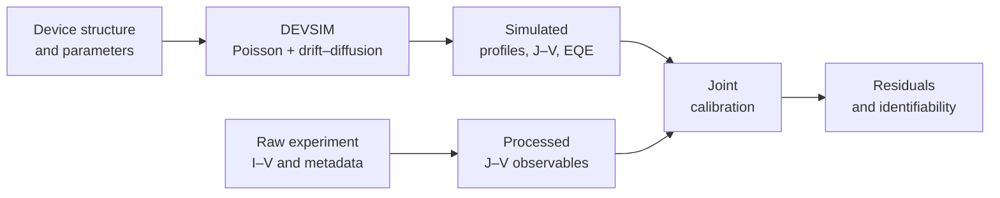

<p align="center">
  
</p>

<h1 align="center">DEVSIM Silicon Solar Cell</h1>

<p align="center">
  <strong>An undergraduate teaching project for semiconductor simulation, experiment, and parameter calibration</strong><br>
  A one-dimensional, front-illuminated p⁺-on-n silicon solar cell
</p>

<p align="center">
  <a href="https://github.com/chenzhang0920/devsim-silicon-solar-cell-teaching/actions/workflows/tests.yml"></a>
  <a href="https://chenzhang0920.github.io/devsim-silicon-solar-cell-teaching/"></a>
  <a href="LICENSE"></a>
  <a href="LICENSE-CONTENT.md"></a>
</p>

This repository is the teaching and laboratory project for **MICS3090 (L01) —
Integrated Circuit Devices**. It connects the equations taught in class to a working
[DEVSIM](https://devsim.net/) model, measured solar-cell data, and a deliberately small
inverse problem. The aim is not merely to produce a curve: students must explain the
device physics, check the experiment, evaluate residuals, and decide which fitted
parameters the available observations can support.



> **Scope:** this undergraduate model demonstrates semiconductor device simulation and
> parameter calibration. It is not intended for fabrication-grade process design or
> parameter extraction.

## 🎓 Course information

| Item | Information |
|---|---|
| Course | **MICS3090 (L01) — Integrated Circuit Devices** |
| Instructor | **Renjie WANG** |
| Teaching assistant | **Zhang CHEN** · [zchen758@connect.hkust-gz.edu.cn](mailto:zchen758@connect.hkust-gz.edu.cn) |
| TA office | **W2-4F-028** |
| Project weight | **10% of the course grade** |
| Assessment | **Five tasks, 100 points** · [public rubric](docs/grading.md) |

Student entry points:

- [Course Website](https://chenzhang0920.github.io/devsim-silicon-solar-cell-teaching/) — the visual landing page for students;
- [Tutorial Notebook](notebooks/tutorial.ipynb) — the guided, executable lesson;
- [Student Lab Guide](docs/lab_guide.md) — what to run, submit, and explain;
- [Experiment Protocol](docs/experiment_protocol.md) — measurement and metadata rules;
- [Student Slides](docs/lab_slides.html) — browser slides for the two lab sessions;
- [DEVSIM Manual (v2.10.0)](https://zenodo.org/records/17328734) — the
  authoritative command and API reference for the simulator.
  This project pins the compatible DEVSIM 2.10.1 runtime used for validation.

Open the [classroom slides online](https://chenzhang0920.github.io/devsim-silicon-solar-cell-teaching/docs/lab_slides.html),
or open `docs/lab_slides.html` after cloning or downloading the repository. Use the arrow
keys or Space to present it; printing from the browser produces a 16:9 PDF handout.

## 🎯 Learning outcomes

After completing the project, students should be able to:

- translate a p⁺-on-n device description into a one-dimensional mesh,
  doping profile, contacts, and boundary conditions;
- relate Poisson and carrier-continuity equations to bands, electric field, carrier
  distributions, recombination, and terminal current;
- use continuation from equilibrium to dark, illuminated, and biased states;
- interpret a solar-cell J–V curve, its standard performance metrics, and modeled EQE;
- convert raw instrument current into traceable current-density data with correct area,
  units, polarity, and metadata;
- calibrate a small set of effective parameters against several compatible observables;
- use residuals, local covariance diagnostics, correlation, and parameter bounds to discuss
  identifiability and model limitations.

## 🚀 Quick start

Run every command below from the repository root. Conda is recommended because
DEVSIM includes native libraries.

### 1. Install and verify the environment

```bash
git clone https://github.com/chenzhang0920/devsim-silicon-solar-cell-teaching.git
cd devsim-silicon-solar-cell-teaching

conda env create -f environment.yml
conda activate devsim_solar

python -c "import devsim; print('DEVSIM:', devsim.__version__)"
```

Create the environment only once. For later sessions, start with
`conda activate devsim_solar`.

### 2. Choose one learning route

#### Route A — interactive Notebook (recommended for learning)

```bash
python -m jupyter lab notebooks/tutorial.ipynb
```

In Jupyter, choose **Restart Kernel and Run All Cells**. Read the Notebook from top to
bottom: structure → equations → solver sequence → internal profiles → J–V/EQE → data
preparation → calibration → adequacy and identifiability. Change one documented setting
in `config.py`, restart the kernel, and run all cells again when making a comparison.

The checked Notebook already contains outputs, so it can also be
[read directly on GitHub](notebooks/tutorial.ipynb) before installation. To refresh and
embed every output without opening Jupyter interactively, run:

```bash
python scripts/run_all.py notebook --dry-run
python scripts/run_all.py notebook
```

#### Route B — reproducible command line (recommended for rebuilding results)

The same Python runner works in Windows PowerShell, macOS Terminal, and Linux shells:

```bash
# Show every planned step without changing files.
python scripts/run_all.py full --dry-run

# Rebuild all checked figures and calibration artifacts, then execute the Notebook.
python scripts/run_all.py full

# Confirm that every classroom-slide asset is present.
python scripts/run_all.py check
```

`full` runs the deterministic synthetic example, forward simulation and figures,
sensitivity sweep, EQE, Cell #3 joint calibration, optimization demonstration, and finally
the executed Notebook. It is the release/reproducibility command, not the first command a
student must wait for during every edit.

### 3. Use focused commands while learning

| Purpose | Command | Main result |
|---|---|---|
| Preview the complete pipeline | `python scripts/run_all.py full --dry-run` | ordered plan; no files changed |
| Fast smoke run | `python scripts/run_all.py quick` | fast forward-model figures; slow fitting/EQE skipped |
| Device physics | `python scripts/run_all.py simulation` | J–V, resistance, profiles, bands, and model map |
| Spectral response | `python scripts/run_all.py eqe` | `results/eqe.png` |
| Standard sensitivity study | `python scripts/run_all.py sweep` | `results/sweep.png` |
| Calibration lesson | `python scripts/run_all.py calibration` | Cell #3 joint-fit and optimization figures |
| One processed sample | `python scripts/run_all.py joint --sample 3` | fitted parameters, metrics, provenance, and fit figures |
| Refresh Notebook outputs | `python scripts/run_all.py notebook` | executed `notebooks/tutorial.ipynb` |
| Validate slide assets | `python scripts/run_all.py check` | pass/fail asset report |

Run `python scripts/run_all.py help` for the same guide in the terminal. Each profile prints
its project root, Python interpreter, ordered substeps, generated files, and completion
status. No Bash, WSL, or platform-specific wrapper is required; activate the environment
and use the same command on Windows, macOS, or Linux.

### 4. Process a new measurement bundle

Raw experimental conversion is deliberately **not** part of `full`: illuminated area,
wiring polarity, and sample identity must be confirmed for each measurement session.
For a complete Keithley bundle using the documented 3 cm × 4 cm illuminated area:

```bash
# 1. Preserve the raw exports in data/raw/keithley/.
# 2. Convert current to current density and build the processed summaries.
python scripts/run_all.py keithley --area 12.0

# 3. Fit that sample only after checking signs, units, coverage, and repeatability.
python scripts/run_all.py joint --sample YOUR_SAMPLE_ID
```

Use `--prune` during conversion only when the raw directory is a complete replacement
bundle. The `full` profile always rebuilds the checked Cell #3 example; it never silently
converts new raw measurements.

## 🔬 Model and conventions

Light enters at $x=0$, through the front contact and p⁺ emitter. The
n-type base extends to the rear contact:

```text
light  →  front contact | p⁺ emitter | n-type base | rear contact
                         x = 0       ↑ x = 0.5 µm junction       → depth
```

The depletion region straddles that metallurgical junction; it is not a separate
material layer and extends mainly into the lower-doped n-type base.

The terminal convention is $V=V_{\mathrm{front}}(p)-V_{\mathrm{back}}(n)$.
Illuminated current density is positive when the cell delivers current, so the illuminated
J–V curve begins at $J_{\mathrm{sc}}>0$ and crosses zero at $V_{\mathrm{oc}}$.
Dark forward current is negative under the same convention.

### Notation and governing equations

Mathematical notation is shared by this README, the Notebook, the course website, and the
classroom deck. Scalar physical quantities are italic, descriptive subscripts are upright,
vectors are bold, operators and units are upright, and code identifiers remain in
`monospace`. For example: $J_{\mathrm{sc}}$, $V_{\mathrm{oc}}$,
$R_{\mathrm{s}}$, $R_{\mathrm{sh}}$, $N_{\mathrm A}$, $N_{\mathrm D}$,
$n_{\mathrm i}$, $\varepsilon_{\mathrm{Si}}$, and
$\boldsymbol{u}=(\psi,n,p)^{\mathsf T}$.

The one-dimensional steady-state system is

$$
\begin{aligned}
\frac{\mathrm d}{\mathrm d x}
\left(\varepsilon_{\mathrm{Si}}\frac{\mathrm d\psi}{\mathrm d x}\right)
&=-q\left(p-n+N_{\mathrm D}^{+}-N_{\mathrm A}^{-}\right),\\
\frac{\mathrm dJ_n}{\mathrm d x}&=q(R-G),\\
\frac{\mathrm dJ_p}{\mathrm d x}&=-q(R-G).
\end{aligned}
$$

The constitutive current laws and the prescribed optical source are

$$
\begin{aligned}
J_n&=q\mu_n nE+qD_n\frac{\mathrm dn}{\mathrm dx},&
J_p&=q\mu_p pE-qD_p\frac{\mathrm dp}{\mathrm dx},\\
G(x)&=s(1-R_{\mathrm f})\sum_i\Phi_i\alpha_i\exp(-\alpha_i x),&
E&=-\frac{\mathrm d\psi}{\mathrm d x}.
\end{aligned}
$$

After the internal DEVSIM solve, the area-normalized terminal map is

$$
J=J_{\mathrm{device}}(V_{\mathrm j})-\frac{V_{\mathrm j}}{R_{\mathrm{sh}}},
\qquad
V_{\mathrm{term}}=V_{\mathrm j}-JR_{\mathrm s}.
$$

The forward model includes:

- finite-volume Poisson and electron/hole drift–diffusion equations;
- SRH and Auger bulk recombination;
- effective near-contact recombination losses represented by thin dead layers;
- a finite-bin teaching spectrum with Beer–Lambert absorption;
- ohmic contacts and optional effective terminal series/shunt resistance.

Core device, solver, and calibration defaults—and their units—are centralized in
[`config.py`](config.py). Students should change that file or documented command-line
options instead of copying physical constants into scripts or the Notebook.

### What the model does not claim

| Included for learning | Important simplifications |
|---|---|
| 1D abrupt p⁺-on-n structure | no texture, front-contact shading, fingers, lateral current spreading, or 2D/3D geometry |
| constant low-field mobilities at 300 K | Boltzmann statistics; no degeneracy, band-gap narrowing, field/doping-dependent mobility, self-heating, or temperature sweep |
| bulk recombination and effective near-contact loss layers | no Robin interface-SRV, selective-contact, process-calibrated interface-state, or passivation model |
| single-pass finite-bin absorption model | no precision ASTM spectrum, interference, ray tracing, rear optical reflection, or calibrated antireflection stack |
| effective terminal parasitics | no spatial contact or interconnect solution |

These simplifications make causal relationships visible and runs short enough for a lab.
They also set the limit of any fitted parameter's physical interpretation. Record the
experimental temperature; a meaningful departure from 300 K must be reported as a
model–experiment limitation rather than hidden by changing `config.py`.

The 16 optical bins approximate the above-band-gap photons that drive generation. The
illustrative efficiency uses a separately stated total modeled irradiance of 100 mW/cm²,
which also represents incident spectral power omitted from the generation bins. This
separation is intentional and is not a precision ASTM G173 power balance.

## 🧪 Data: measured, processed, and synthetic

The directory name is part of the provenance record:

| Location | What belongs there | How to use it |
|---|---|---|
| [`data/raw/`](data/raw/README.md) | unmodified instrument exports | preserve as the experimental source record |
| [`data/processed/`](data/processed/README.md) | standardized experimental J–V tables and summaries | use for measured-data analysis and calibration |
| [`data/synthetic/`](data/synthetic/README.md) | deterministic model-generated J–V example | use only for hardware-free smoke tests |
| `results/` | rebuildable simulations, figures, fit metadata, and reports | never present these as new measurements |

The bundled Cell #3 and Cell #4 files are **historical course measurements** provided so
the complete workflow can be demonstrated before a new lab session. They are not a
student's own experimental result. The synthetic J–V file is generated by the model and
must not be described as measured data.

The checked bundled J–V tables use the recorded illuminated dimensions of 3 cm × 4 cm,
or a 12.0 cm² current-density normalization area. This value applies only to the bundled
example; students must use the area recorded for their own measurement session.

When replacing the examples with a new experiment:

1. keep the original export unchanged under `data/raw/`;
2. record sample, illuminated area, temperature, source condition, wiring, instrument
   settings, sweep direction, units, and polarity;
3. convert a generic illuminated I–V sweep with `prepare_data.py`, or a complete native
   Keithley measurement bundle with `prepare_keithley.py`, using the measured area rather
   than an example value;
4. inspect the processed curve for units, ordering, short-circuit coverage, and a
   physically consistent zero crossing;
5. keep the exact inputs, configuration, fitted metadata, residuals, and figures together.

Experimental efficiency may be reported only when irradiance at the cell plane has been
measured independently. An effective generation scale or a total optical-power reading is
not a substitute for irradiance.

## 🎯 Canonical calibration: Cell #3

The recommended teaching inverse problem is the Cell #3 joint calibration:

```bash
python scripts/run_calibration.py --joint --sample 3
```

It combines four compatible evidence blocks while keeping their scales and weights
explicit:

| Observable | Information contributed |
|---|---|
| illuminated J–V | photocurrent, knee shape, and zero crossing |
| dark J–V | forward-current cross-check; limited leverage on effective series resistance |
| repeated illuminated short-circuit readings | separately acquired current anchor and repeatability |
| illuminated open-circuit voltage | separately acquired voltage anchor |

The canonical joint exercise varies only a deliberately small set of effective parameters. In
particular, the fitted generation scale is not a measured number of suns, and an effective
series resistance may include the device, contacts, wiring, and model discrepancy. A close
curve is therefore not sufficient evidence of a unique material parameter.
The dark curve is chiefly a cross-observable model check in this two-parameter exercise; it
does not identify lifetime, interface recombination, or detailed diode physics because those quantities remain
fixed by design.

Each optimizer evaluation computes one self-consistent illuminated terminal curve and one
self-consistent dark terminal curve. Predictions for illuminated J–V and the separately
acquired $J_{\mathrm{sc}}$ and $V_{\mathrm{oc}}$ anchors come from the same illuminated
solution. Each output table reports the normalized
RMS and objective share of every observation block, so systematic mismatch cannot be hidden
inside one aggregate value. The normalized block score is the weighted mean squared
discrepancy: 1 matches the stated scales on average and 4 corresponds to a twice-scale
weighted RMS mismatch. It is a model–data adequacy teaching diagnostic, not a statistical
reduced chi-square. If the model–data adequacy gate fails, covariance indicates only local
optimizer sensitivity, not physical adequacy or unique parameter identification.

- **Observe:** name the strongest block-level residual pattern.
- **Verify:** assess measurement adequacy with two checks such as voltage coverage,
  repeatability, polarity/area, or dark leakage.
- **Test one:** test one single-factor hypothesis and predict the direction in which its
  change should move that residual.
- **Decide:** accept a physical interpretation only if the evidence survives those checks;
  otherwise demonstrate the workflow and remeasure. See the
  [Tutorial Notebook](notebooks/tutorial.ipynb) and [Student Lab Guide](docs/lab_guide.md).

Interpret these outputs together:

- `results/joint_observables.png` — agreement across all observation blocks;
- `results/joint_metrics.json` — numerical residual summaries;
- `results/joint_fitted_params.json` and `results/joint_fit_metadata.json` — fitted values,
  bounds, gate-qualified local covariance diagnostics, configuration, software versions,
  and data provenance;
- `results/joint_identifiability.png` — local covariance scales and parameter
  correlation, explicitly qualified by the model–data adequacy gate.

To redraw the saved joint fit without running the optimizer again, use:

```bash
python scripts/plot_fit.py --params results/joint_fitted_params.json
```

The replay command verifies the recorded data hashes and solver configuration before it
recreates the figure and numerical checks.

Measured EQE is not required for the assessed workflow. The supplied EQE figure is a
modeled spectral-collection exercise; measured EQE can be added later as an independent
extension when suitable laboratory data exist.

## 📊 Teaching figures

The checked figures follow the conceptual order used in the Notebook and lab guide.
Captions state whether an item is simulated, synthetic, or measured.

<p align="center">
  
  <br><sub><strong>Model map.</strong> Structure, equations, solution sequence, and observables.</sub>
</p>

<p align="center">
  
  <br><sub><strong>Internal state.</strong> Spatial profiles connect the junction to carrier separation and collection.</sub>
</p>

<p align="center">
  
  <br><sub><strong>Terminal response.</strong> A DEVSIM sweep and its labeled synthetic reference show the sign convention and operating points.</sub>
</p>

<p align="center">
  
  <br><sub><strong>Spectral response.</strong> Modeled EQE is interpreted relative to the single-pass absorption reference used by this optical model.</sub>
</p>

Rebuildable images are checked into `results/` so the lesson remains readable on GitHub.
After changing physics, data, or calibration settings, regenerate the relevant outputs and
review both the plots and their metadata before committing them.

## 🗂 Repository map

```text
config.py                 model, solver, and calibration settings
model/                    DEVSIM device equations, solution, analysis, and visual helpers
calibration/              data loading, joint objective, reports, and fit diagnostics
scripts/                  command-line simulation, conversion, plotting, and build tools
data/raw/                 immutable historical or student instrument exports
data/processed/           standardized measured J–V data and summary observables
data/synthetic/           model-generated J–V smoke-test data
notebooks/tutorial.ipynb  executable student lesson with embedded outputs
docs/                     lab guide, experiment protocol, rubric, and classroom slides
results/                  checked, reproducible outputs used by the teaching materials
tests/                    automated checks and DEVSIM physics tests
```

The intended reading order is:

1. this README and the [lab guide](docs/lab_guide.md);
2. [`config.py`](config.py) and the [Tutorial Notebook](notebooks/tutorial.ipynb);
3. the relevant command-line script;
4. model or calibration internals only when the lesson asks for them.

The compact artifact index in [`results/README.md`](results/README.md) separates assessed
outputs from instructor-support figures. Optional light-only fits may create additional
local `fit_*` files; they are not part of the checked baseline because the joint workflow
is the canonical assessed calibration.

## ✅ Assessment

The [grading rubric](docs/grading.md) totals exactly 100 points:

| Task | Focus | Points |
|---:|---|---:|
| 1 | structure, equilibrium, and built-in field | 20 |
| 2 | illumination, J–V performance, and EQE | 20 |
| 3 | parameter sensitivity | 15 |
| 4 | experimental data and joint calibration | 30 |
| 5 | identifiability, limitations, and reproducibility | 15 |
| **Total** |  | **100** |

The lab guide uses the same five-task order and a consistent
**Goal → Run → Submit → Explain** pattern. Figures need readable labels and units;
synthetic data must be identified; and every conclusion should be supported by a plot,
table, residual, or metadata record.

## 🛠 Verification and help

Run the automated checks, DEVSIM integration tests, and slide-asset check:

```bash
python -m pytest tests -q
python -m pytest tests -m slow -q
python scripts/build_slides.py --check
```

| Problem | First check |
|---|---|
| `ModuleNotFoundError: devsim` | activate `devsim_solar` and verify the import shown in Quick start |
| implausible J–V polarity | compare raw wiring with the voltage/current convention before flipping signs |
| nonlinear solve failure | restore the checked voltage range and continuation settings, then change one item at a time |
| visually good fit but large local covariance scale | report the scale and correlation; do not add more varied parameters |
| unfamiliar command option | for a script with options, run `python scripts/<script>.py --help` from the project root |

For course questions, contact **Zhang CHEN** at
[zchen758@connect.hkust-gz.edu.cn](mailto:zchen758@connect.hkust-gz.edu.cn) or visit the
TA office at **W2-4F-028**. For a reproducible bug or documentation correction, use the
repository's [GitHub Issues](https://github.com/chenzhang0920/devsim-silicon-solar-cell-teaching/issues)
or follow [`CONTRIBUTING.md`](CONTRIBUTING.md).

## 📄 License and citation

- Source code and automation: [MIT License](LICENSE).
- Teaching text, original figures, and shareable course data:
  [CC BY 4.0](LICENSE-CONTENT.md).
- The HKUST(GZ) logo remains subject to university trademark and usage rules.

Citation metadata are provided in [`CITATION.cff`](CITATION.cff), which enables GitHub's
**Cite this repository** menu. When adapting the project, identify your changes and keep
the distinction between historical measurements, synthetic examples, and new student data
visible.
